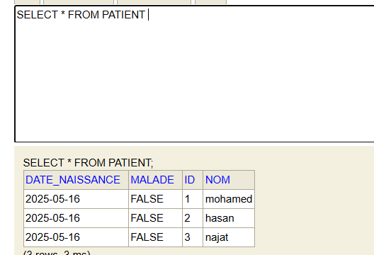
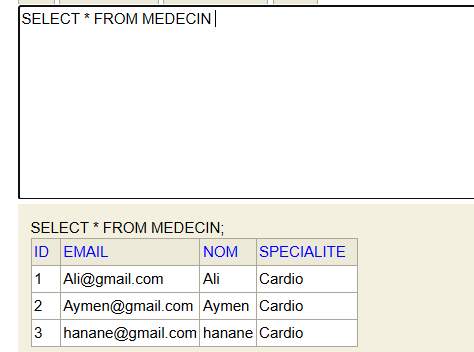
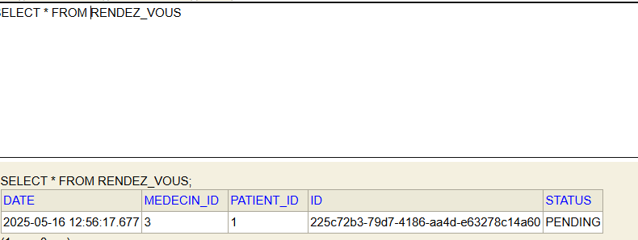
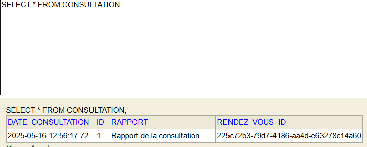

# 🏥 TP Spring Boot : Gestion d'un hôpital

## 🎯 Objectif du TP

Dans ce TP, j'ai réalisé une application de gestion hospitalière en utilisant **Spring Boot**. L’idée était de manipuler les entités comme les patients, les médecins, les rendez-vous et les consultations, en utilisant **Spring Data JPA** pour la persistance des données. J’ai aussi suivi une architecture simple basée sur le modèle MVC.

---

## 🧱 Structure du projet

Voici la structure principale que j’ai mise en place :

- **Entities (`entites/`)** : J’ai défini les entités suivantes avec les annotations JPA :
  - `Patient`
  - `Medecin`
  - `RendezVous`
  - `Consultation`

- **Repositories (`repositories/`)** : Ce sont les interfaces qui étendent `JpaRepository` pour interagir avec la base de données.

- **Service (`service/`)** :
  - Une interface `IHospitalService` que j’ai définie.
  - Une classe d’implémentation `IHospitalServiceImpl` dans laquelle j’ai codé la logique métier pour insérer les données.

- **Classe principale (`HospitalApplication`)** : C’est ici que j’ai utilisé `CommandLineRunner` pour insérer automatiquement des données lors du démarrage de l’application.

---

## 🗃️ Fonctionnalités que j’ai développées

- ✅ Création des entités avec les bonnes annotations JPA
- ✅ Définition des relations entre les entités (par exemple, `@ManyToOne`, `@OneToMany`)
- ✅ Création de services pour gérer les opérations de création
- ✅ Insertion automatique des patients, médecins, rendez-vous et consultations dans la base de données H2
- ✅ Affichage de certains enregistrements dans la console pour vérifier que tout fonctionne bien

---

## 📸 Quelques captures d’écran

Voici quelques aperçus des données que j’ai insérées :

### 🔍 Patients enregistrés


### 🩺 Médecins insérés


### 📅 Rendez-vous créés


### 📝 Consultation enregistrée


---

## 💡 Ce que j’ai appliqué techniquement

- J’ai utilisé `CommandLineRunner` pour insérer automatiquement des données de test au démarrage
- J’ai injecté les dépendances dans mes classes via le constructeur
- J’ai utilisé une base de données **H2 en mémoire**, ce qui est pratique pour les tests
- La console H2 est accessible à cette adresse : `http://localhost:8080/h2-console`

---

## 🚀 Comment lancer le projet

Pour lancer l’application, j’utilise simplement la commande suivante :

```bash
mvn spring-boot:run
